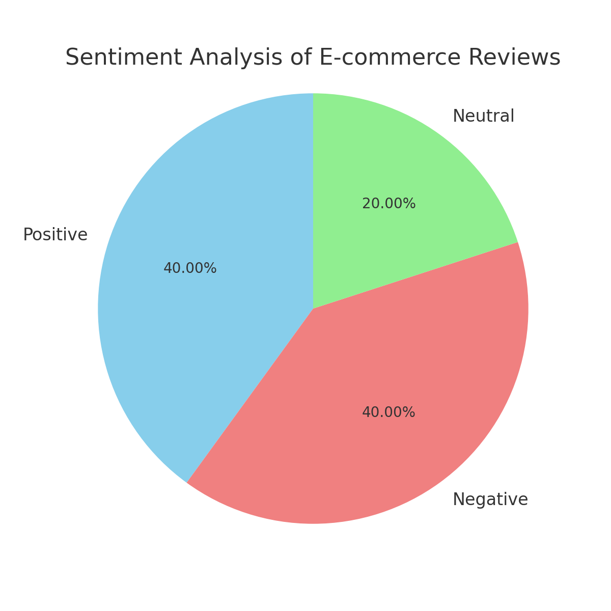

# FUTURE_DS_02

# Ecommerce Sentiment Analysis Project 📊🛒

This is the submission for Task 2 of Future Interns.

## Project Overview 🚀

This project performs a simple **Sentiment Analysis** on e-commerce product reviews using Python. It classifies reviews as **positive** 😊, **negative** 😞, or **neutral** 😐 based on keyword matching.

The goal is to analyze customer sentiments from a sample dataset and visualize the results in a pie chart.

---

## Dataset 📁

The dataset [`sample_reviews.csv`](data/sample_reviews.csv) contains customer reviews from an e-commerce platform. You can directly view or download the CSV file from the `data` folder.

---

## How to Run ▶️

1. Clone the repository:
   ```bash
   git clone https://github.com/Gyanankur23/Ecommerce-sentiment-analysis-Project-.git
   cd Ecommerce-sentiment-analysis-Project-

2. Ensure you have Python installed (recommended version 3.6+).


3. Install dependencies (if not already installed):

pip install pandas matplotlib


4. Run the sentiment analysis script:

python data/sentiment_analysis.py


5. The script will output the counts and percentages of positive, negative, and neutral reviews, and display a pie chart.


---

File Structure 🗂️

Ecommerce-sentiment-analysis-Project-/
│
├──——data
│   ├── sample_reviews.csv
│   └── sentiment_analysis.py
│
├── output/
│   └── sentiment_pie_chart.png
│
└── README.md


---

Results 📈

Positive reviews, negative reviews, and neutral reviews are classified based on simple keyword matching.

A pie chart visually represents the sentiment distribution, helping quickly understand customer feedback trends.




---

Repository Link 🔗

https://github.com/Gyanankur23/Ecommerce-sentiment-analysis-Project-.git


---

Thank you for visiting! 🙏 Feel free to contribute or raise issues.

